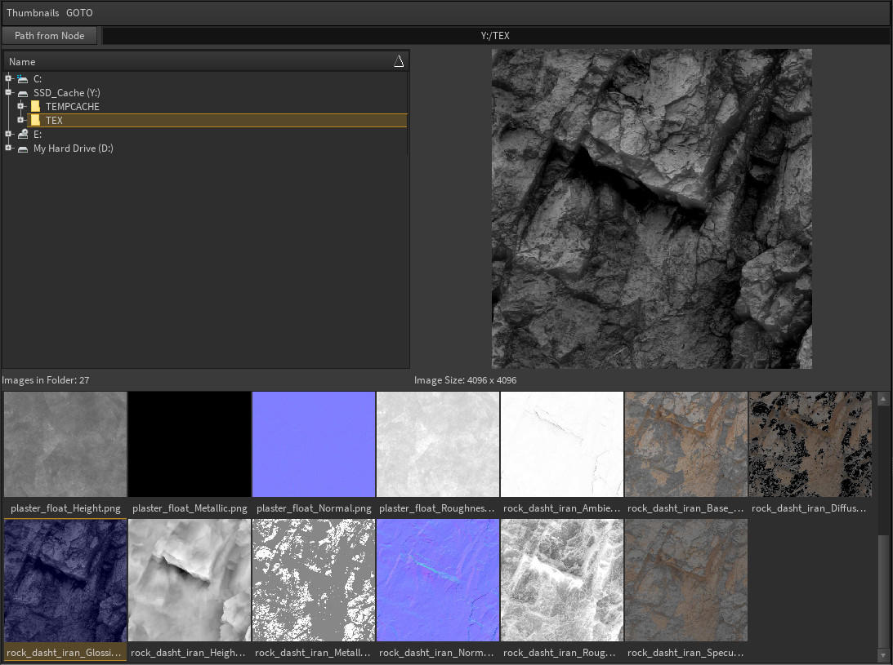

# Houdini_Image_Browser

Python Panel image browser with automatic thumbnail generation (multithreaded), large preview and Houdini node interaction.

## Installation

* Install imagemagick for your system following the instructions here: https://docs.wand-py.org/en/0.6.6/guide/install.html#install-imagemagick-on-windows
* Make sure to install the C/C++ headers and set the MAGICK_HOME environment variable
* Copy the "Houdini_Image_Browser.json" package file to $HOME/houdini18.5/packages and edit the path to point to the root folder of Houdini Image Browser
* A custom thumbnail folder can be specified with ./scripts/python/Houdini_Image_Browser/config.json

## Usage

* Browse your system via the tree view or text bar. Image thumbnails are generated on the fly for a wide range of formats including EXR and HDR.
* You can alter the thumnbail size with the Thumbnail menu
* You can also use this menu to generate thumnbails for a directory recursively, without needing to navigate through each subfolder. This is useful for initialising thumbnails for a large texture/HDRI collection.
* Use the GOTO menu to save directories for quick navigation or to set a default path for the panel to load at startup
* Click a thumnbail for a large preview. Double-click to send this image path to a selected node (e.g a Texture Node in /mat). If no nodes are selected the path is added to the clipboard.