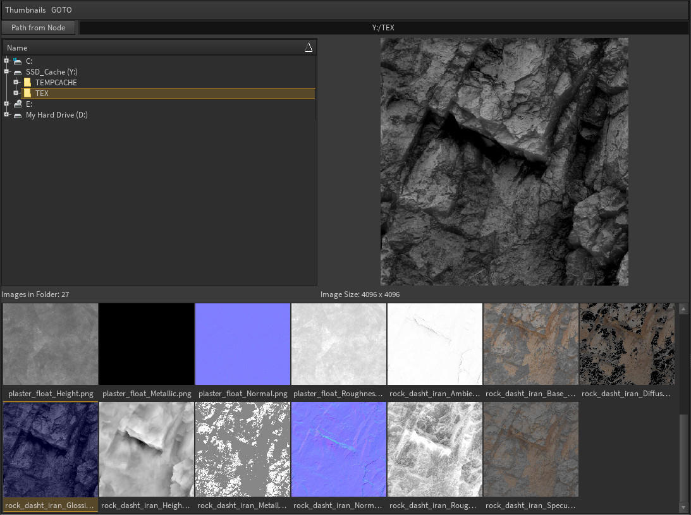

# Houdini_Image_Browser

Python Panel featuring a thumbnail database with automatic thumbnail generation, enlarged preview and interaction with Houdini Nodes.

## Installation

* Download and extract the repository into $HOME/houdini17.0/scripts/python
* Move HoudiniImageBrowser.pypanel from /_install to $HOME/houdini17.0/python_panels
* Install imagemagick for your system following the instructions here: http://docs.wand-py.org/en/0.5.0/guide/install.html#install-imagemagick-on-windows
* Install the python dependencies by running `pip install --target=%USERPROFILE%\Documents\houdini17.0\python2.7libs -r requirements.txt` from within the /_install directory. This needs a system install of Python27.

## Usage

* Browse your system via the tree view or text bar. Image thumbnails are generated on the fly for a wide range of formats including EXR and HDR.
* You can alter the thumnbail size with the Thumbnail menu
* You can also use this menu to generate thumnbails for a directory recursively, without needing to navigate through each subfolder. This is useful for initialising thumbnails for a large texture/HDRI collection.
* Use the GOTO menu to save directories for quick navigation or to set a default path for the panel to load at startup
* Click a thumnbail for a large preview. Double-click to send this image path to a selected node (e.g a Texture Node in /mat). If no nodes are selected the path is added to the clipboard.

## Info

* Thumbnail generation uses the Wand Python API for Imagemagick. Multithreading is achieved with a QThreadPool